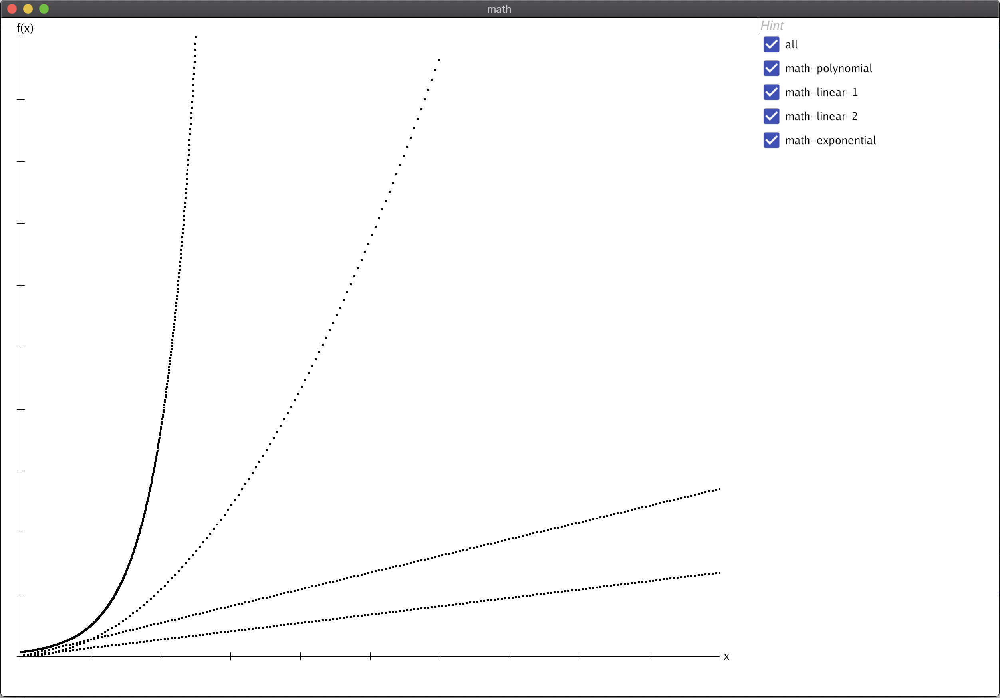

# Examples

- [plotting of mathematical functions](graph/graph.go)
generated mathematical functions

- [plotting of go benchmark results](bench/bench.go)
used the benchmark output from [lachesis](https://github.com/drakos74/lachesis) 

